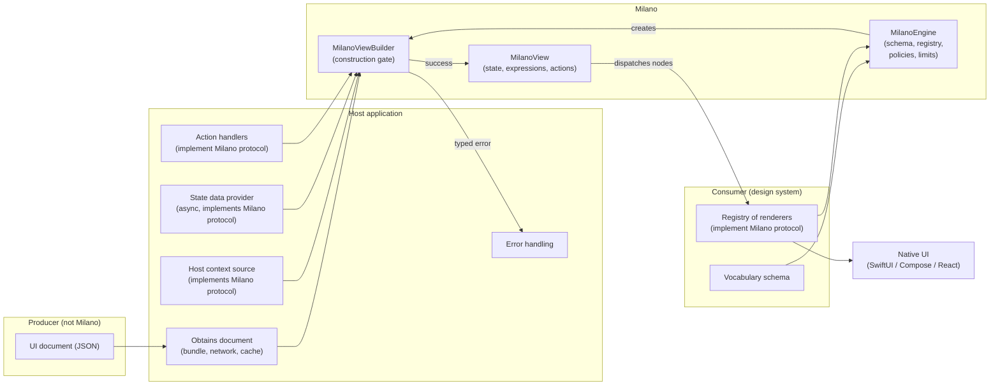
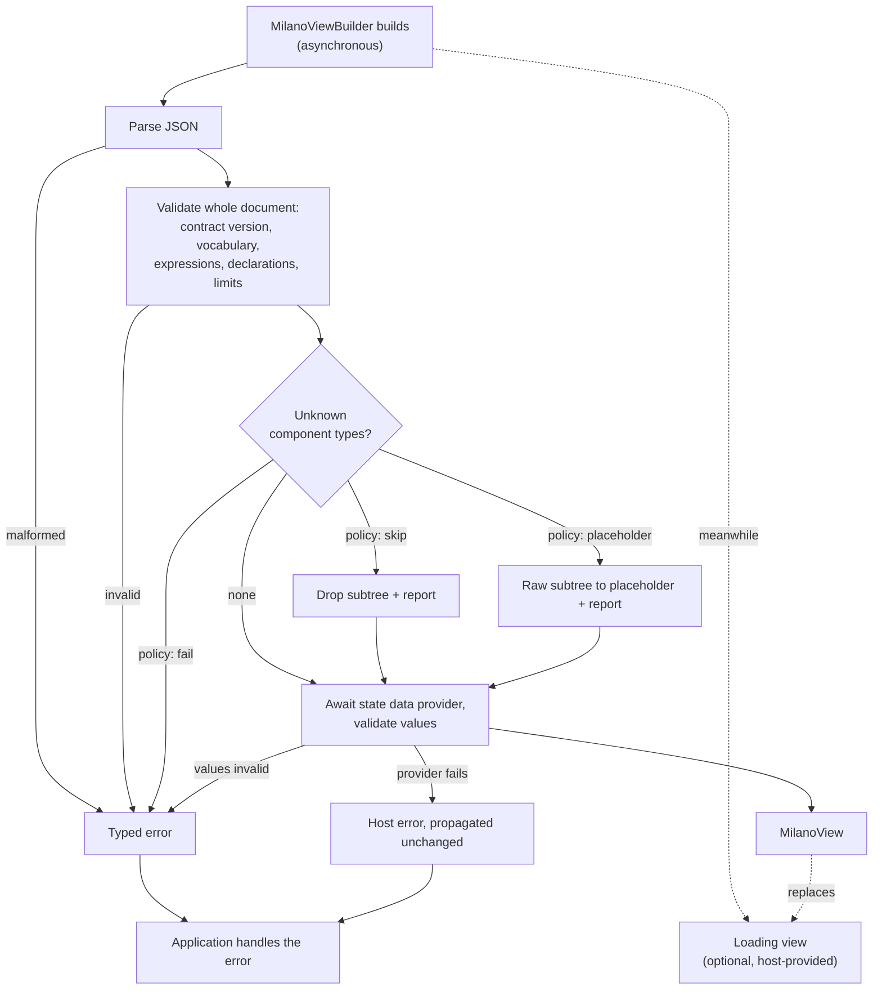
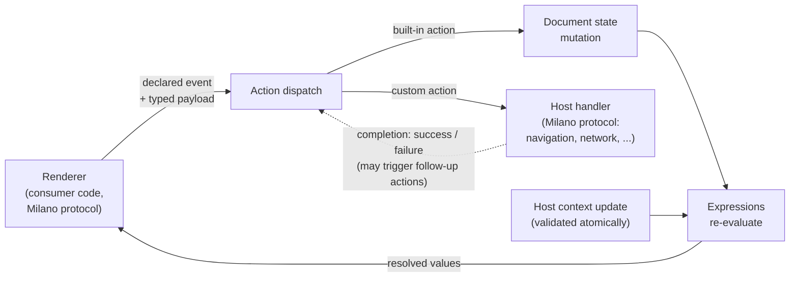

# Milano Foundations

**Status:** Stable · contract 2.0 · repository release 2.0.0 · 2026-08-29

## Definition

Milano is a client-only, design-system-agnostic Document-Driven UI (DDUI) framework for SwiftUI, Compose, and React. Document-driven rather than server-driven: Milano is agnostic of how the document is obtained.

Milano targets UI toolkits, not operating systems: it is usable wherever SwiftUI runs (iPhone, iPad, macOS, watchOS), wherever Compose runs (Android, desktop), and wherever React runs (the web, and React Native on iOS and Android). The sample apps target iOS, Android, desktop, and React Native.

Milano consumes **UI documents**. Where a document comes from (bundled file, network, cache) is the host's concern, never Milano's. Milano defines the **mechanics** of document-driven UI: the document model, its expression language, its state and action models, and the runtimes that materialize documents into native UI. The consumer defines everything else: the **component vocabulary** and its **visual rendering**.

Milano ships no components and no visuals. It is a meta-framework: the machinery for building your own document-driven UI system, not a UI system itself.

## What Milano is not

Three things Milano is regularly mistaken for, and is not:

1. **Not server-driven UI.** Milano never talks to a server. There is no server side, no fetching, no delivery protocol, no backend to run. A document may come from a server, a bundle, a cache, or a test fixture; Milano cannot tell the difference and does not care. That is why it is document-driven, not server-driven.
2. **Not a SaaS.** There is no hosted service, no dashboard, no campaign manager, no delivery network, nothing to sign up for and no meter running. Milano is client libraries and a contract; everything operational belongs to whoever adopts it.
3. **Not a design system.** Milano ships zero components, zero styles, zero opinions about appearance. The consumer's design system draws every pixel; Milano only guarantees that what reaches it is validated, typed, and behaviorally consistent across platforms.

The mechanics-level exclusions (no networking, no scripting, no app-wide state, and the rest) are listed in "What Milano does not do" below.

## Scope

The contract exists to model and ship exactly two things, since its first version:

1. **Banners and interstitials**: document-defined promotional or informational surfaces, with conditional visibility, personalized content through context, and host-handled actions (dismiss, navigate, track).
2. **Simple forms**: document-defined fields whose composition changes by changing the document; values pre-filled through the state data provider, edited through events and `$set`, submitted through a custom action with success and failure follow-ups.

These two use cases decide inclusion: a mechanic neither of them needs stays out of the contract. They are the conformance targets, not a ceiling: the same mechanics serve whole screens whose structure changes more often than their components, such as user profile screens and intermediate screens like a catalog, and the SDK's sample apps ship both.

## Glossary

- **Document**: a self-contained, versioned description of one UI tree, expressed in Milano's document model. Canonical encoding: JSON.
- **Node**: one element of a document's tree. Every node has a component type and properties; it may declare children, state bindings, and actions.
- **Component type**: a named entry in a vocabulary. It defines what a node of that type supports: properties and events.
- **Vocabulary**: the complete set of component types a consumer defines. Milano has none of its own.
- **Vocabulary schema**: the machine-readable artifact that declares a vocabulary. Drives validation and tooling.
- **Producer**: whatever authors or serves documents (backend, CMS, build step, bundled file). Milano never communicates with it.
- **Consumer**: the team adopting Milano. Defines the vocabulary, implements renderers, configures the framework.
- **Host** (host application): the running app that embeds MilanoViews and supplies documents, host context, and action handlers at runtime.
- **Renderer**: a consumer-provided implementation that turns nodes of one component type into native UI (a SwiftUI view, a composable, or a React element).
- **Registry**: the mapping from component types to renderers, plus the placeholder renderer when the *placeholder* policy is used.
- **MilanoEngine**: the instantiable root of the framework. Holds one configuration (vocabulary schema, registry, default policy, limits), owns the shared machinery (parser, validator, expression evaluator), and is the factory for MilanoViewBuilders.
- **MilanoViewBuilder**: the only way to create a MilanoView; the construction gate. Obtained from a MilanoEngine. Building either throws a typed error or returns a renderable view.
- **MilanoView**: a view bound to one document for its lifetime; the binding is immutable, the presentation is dynamic (state, context).
- **Loading view**: an optional host-provided view presented while asynchronous building runs; replaced by the MilanoView on success. Not to be confused with the placeholder renderer.
- **MilanoHost**: the hosting container that manages the loading-to-view swap for hosts that want it; defined in the runtime API spec.
- **Document state**: mutable named values whose shape (name, type) is declared by the document and whose initial values come from the state data provider. Written only by built-in actions, read by expressions. Documents reference state; they never contain its values.
- **State data provider**: a Milano-defined protocol the host implements; an asynchronous source of initial state values, awaited during building and validated against the document's declarations.
- **Host context**: read-only values the host injects (locale, flags, user attributes) for expressions to reference. Its keys and types are declared by the document. Observable: the host may update them over a view's lifetime; updates are validated atomically.
- **Event**: a typed occurrence a renderer emits, declared by its component type in the vocabulary schema; may carry a payload typed by that schema.
- **Expression**: a pure computation over document state and host context. No side effects.
- **Action**: a declared effect. Built-in (state mutation, sequence, conditional) or custom (routed as data to host handlers, which complete asynchronously with success or failure).
- **Observer**: a Milano-defined protocol registered on the engine; receives every reported occurrence, tagged with the originating view.
- **Gate**: the validation a MilanoViewBuilder performs when building: parse, version, vocabulary requirement, limits, the vocabulary walk, and the data checks, in the fixed order of the document model spec. Everything Milano can reject is rejected there.
- **Surface**: one configured builder: a document plus the host inputs and grants configured for it (context source, state data provider, action handler, action allowlist and declarations, policy override). Conformance vectors describe a surface in their `config`.
- **Occurrence**: a defect or diagnostic the runtime reports to the observer rather than failing on (an unknown type skipped, a dropped event, a rejected update, a division by zero); the closed set of kinds is in the runtime API spec.
- **User interaction**: a record on the analytics stream (an impression, an event, a dispatch, a completion, a renderer-reported signal), delivered to the user-interaction observer; never an occurrence.
- **Dispatch**: what happens to an emitted event: payload validation, the binding lookup, and execution of the bound action list, one event at a time on the dispatcher.
- **Dispatcher**: the serialization seam every state-touching operation runs through, one item at a time; the platform main thread by default.
- **Resolution**: computing every property's value from its literal or expression over the current state and context; re-resolution follows an update and reaches only what read a changed key.

## At a glance

Who owns what. Milano sits between a document it did not fetch and native UI it does not draw:

The construction gate. Everything that can be rejected is rejected here; nothing fails afterwards inside Milano's mechanics:

The runtime loop. Strictly unidirectional; renderers never touch state, and the only exits are custom actions routed to the host:

## Principles

1. **Contract over implementation.** Milano's core is a versioned, platform-neutral document model. Everything else exists to serve it.
2. **Mechanics parity, not pixel parity.** The same document produces identical parsing, validation, expression evaluation, state transitions, action dispatch, and fallback behavior in every runtime. Component behavior and appearance belong to the consumer and may differ. Parity is enforced by a shared conformance suite every runtime must pass, not by shared code: the runtimes are independent pure-Swift, pure-Kotlin, and pure-TypeScript implementations.
3. **Open vocabulary.** Milano defines no component types. Consumers author their own vocabulary as a machine-readable schema; Milano validates documents against it and routes each node to the consumer's implementation.
4. **Total rendering.** Acceptance is all-or-nothing and happens at one explicit gate: constructing a Milano view from a document parses and validates it completely, including detecting component types absent from the registry. A malformed or incompatible document makes construction fail with an error the application handles; Milano shows no error UI of its own. Unknown types follow the developer-configured policy (skip, fail at the gate, or placeholder). Once construction succeeds, no document-validation, compatibility, or registry-resolution failure can occur: everything Milano could reject or degrade was resolved at the gate. Consumer code (renderers, action handlers) remains ordinary code that can fail; such failures are consumer defects outside this guarantee. Within Milano's mechanics there is no partial-crash middle ground.
5. **Declarative end to end.** Documents are data. Expressions are pure. Effects exist only as declared actions. Rendering targets declarative toolkits (SwiftUI, Compose, React) exclusively.
6. **Structure without data.** A document describes structure and declares the shapes of the data it needs; it never contains variable data values. State and context values are injected by the host and validated against the document's declarations. The same document renders different data without changing a byte.

## What Milano does

- **Document model.** A versioned, platform-neutral model of a UI as a tree of typed nodes with properties, state declarations, expressions, and actions. Canonical encoding: JSON. A document can describe a full screen or a fragment embedded in a native screen; a screen is just a root node.
- **Vocabulary schema.** The format in which consumers define their component types (names, properties, events) as a machine-readable artifact. It drives document validation and enables tooling (type-safe binding generation, producer-side checks) so every runtime and every document producer stay in sync by tooling, not discipline.
- **Client runtimes.** SwiftUI, Compose, and React libraries that parse and validate documents, evaluate expressions, manage state, materialize the node tree, and dispatch each node to the consumer's registered renderer. Each runtime runs wherever its toolkit runs; the React runtime is a toolkit-free TypeScript engine plus one binding that serves the web and React Native alike, because Milano draws nothing and so has nothing platform-specific to ship.
- **Engine.** MilanoEngine is the instantiable root of the framework. An engine instance holds one configuration: the vocabulary schema, the registry of renderers (including the placeholder renderer, when used), the default unknown-type policy, and resource limits. It owns the shared machinery: parser, validator, expression evaluator. MilanoViewBuilders are obtained from an engine instance, so every MilanoView is traceable to exactly one configuration. An app may run several engines (distinct vocabularies, tests); there is no global singleton and no global mutable state.
- **Construction gate.** A MilanoView is created exclusively through a MilanoViewBuilder, obtained from a MilanoEngine. The host configures the builder (the document, the context source, the state data provider, action handlers, and any per-view unknown-type policy override) and builds. Building is asynchronous: the document is parsed and validated in full, then the state data provider is awaited and its values are validated against the document's declarations. On failure building throws a typed error describing what was rejected (provider failures propagate to the caller unchanged: they are host errors, not Milano errors), and the application handles it. On success, the returned MilanoView is guaranteed free of Milano-caused failures: no document-validation, compatibility, or registry-resolution failure can occur after the gate. Failures inside consumer code are outside this guarantee.
- **Loading view.** Because building is asynchronous, the hosting container (MilanoHost, runtime API spec) accepts an optional host-provided loading view: it presents it immediately, then replaces it with the MilanoView once building completes. Building failures still surface to the application as typed errors; the host decides what replaces the loading view then. Milano ships no loading visuals of its own, and hosts that prefer to await building directly and manage their own transition simply omit the container. The split is a rule: the builder carries gate concerns only (the document, data sources, handlers, action grants, policy), and everything about presentation, loading content included, belongs to the hosting container, which is why the builder has the same shape on every toolkit. Distinct from the placeholder renderer, which handles unknown component types.
- **Error model.** Every failure Milano can surface is a typed error from a small closed set, each carrying structured detail: the path in the document, what was expected, what was found. Gate errors (malformed encoding, schema violation, unsupported version, unknown type under the *fail* policy, limit exceeded) are defined in the document-model spec; engine-creation errors (invalid vocabulary, incomplete registry) in the vocabulary schema spec. Hosts branch on the small set to choose their response (fallback document, update prompt, error screen); details serve diagnostics. New failure kinds extend the details, not the set, so host code does not break.
- **Registry.** The binding mechanism from vocabulary types to consumer renderers. A placeholder renderer is required only when the unknown-type policy is *placeholder*; unknown nodes are then routed to it with their raw subtree as data.
- **Renderer contract.** Rendering is a two-way boundary with one data flow. Outbound: the runtime hands each renderer its node's resolved property values. Inbound: a renderer emits only the events its component type declares in the vocabulary schema, with payloads typed by that schema (a change event carries the new value). An event triggers whatever actions the document binds to it; an event with no binding is dropped and the occurrence is reported to the host for observability. Invalid emissions get the same treatment: an undeclared event, or a payload not matching the declared type, never reaches action dispatch; it is dropped and the violation is reported to the host. This behavior is a conformance case, identical in every runtime; debug builds may additionally assert as a non-normative aid. Renderers never touch document state directly. The flow is strictly unidirectional: renderer emits an event, the bound declared action mutates state, expressions re-derive, the renderer receives new values. There is no two-way binding.
- **Unknown-type policy.** The developer configures how unknown component types are handled: as the engine default, overridable per view construction. The default is *fail*: degradation is a per-surface decision, never an accident of setup. The rule of thumb: *fail* for any surface whose meaning changes when content is missing (forms, consent, checkout, disclosures); *skip* or *placeholder* only for optional surfaces such as promotional banners, where a gap is an acceptable rendering. Three behaviors: *skip* (drop the node and its entire subtree, keep siblings), *fail* (construction throws at the gate, same as any invalid document), or *placeholder* (route the node and its raw subtree to the registered placeholder renderer). An unknown node and its descendants form one opaque unit: document-model structure is still validated for every node, but vocabulary-level validation stops at the unknown node, and Milano evaluates no expressions or actions inside its subtree. The placeholder receives the raw subtree as data, never as live children. Detection always happens at the construction gate; only the response differs. In every case the occurrence is reported to the host for observability.
- **Expression language.** Pure and declarative: expressions read document state and host context to compute values (visibility, enablement, text, derived properties). No side effects, no loops, no user-defined functions. Deliberately not Turing-complete.
- **State model.** Documents declare state shape only: names and types, never values. Initial values are supplied by the host through an asynchronous state data provider given to the builder; the gate awaits it and validates the values against the declarations. Built-in actions are the only writers; expressions are the readers. The host may also inject read-only context values (locale, flags, user attributes) that expressions can reference. A document declares the context keys and types it reads; the gate validates the supplied context against that declaration. Host context is observable: the host may update its values over a view's lifetime, and dependent expressions re-evaluate reactively. Every update is validated atomically against the same declaration: an invalid update is rejected whole, reported to the host, and the previous values remain in effect. Shapes belong to the document; all values, initial and ambient, come from outside it.
- **Action model.** Milano specifies only the actions its runtime must interpret itself: state mutation, sequencing, conditional dispatch. Every other action (navigation, network, analytics, anything) is an open, consumer-defined type routed to host-provided handlers as data. Action names and parameter shapes are declared only by consumer code: globally in the vocabulary, narrowed or overridden per surface by the builder. Documents never declare actions; a document binding an action outside the surface's granted set fails at the gate. Declarations type the payload; meaning is assigned per surface by the builder's handler. Custom dispatch is asynchronous: the handler completes with success or failure, and a document may bind follow-up actions to each outcome. A success completion may carry a typed value when the action declares a result type; the value binds the `result` expression root inside `onSuccess`. Completion ordering, concurrency, result validation, and behavior when the view no longer exists are fixed in the state and actions spec.
- **Observability.** Every reported occurrence flows to a Milano-defined observer protocol registered on the engine, tagged with the identity of the originating view: unknown types, undeclared properties, dropped events, invalid emissions, invalid and duplicate completions, completions after teardown, rejected context updates, rejected mutations, and arithmetic reports. The complete taxonomy is fixed in the runtime API spec. One integration point per engine for logging and telemetry. User interactions are deliberately not occurrences: a separate engine-scoped user-interaction stream (runtime API spec) carries taps, edits, dispatches, impressions, and renderer-reported signals such as focus to the host for product analytics, with documents declaring nothing for it.
- **Threading.** Renderer dispatch, follow-up action execution, and runtime observer callbacks happen on the main thread. Action handlers are invoked asynchronously off the serialization seam, with immutable data; their completions are validated and applied on the main thread. Context updates may be posted from any thread; validation and application happen on the main thread.
- **Untrusted input.** Every document is treated as untrusted, wherever it came from: full validation at the gate, no code execution (expressions are deliberately not Turing-complete), and resource limits (depth, node count, size, expression length, value size) with safe defaults fixed by the document-model spec, adjustable per engine. Limits apply at the gate and at runtime: update-triggered evaluation is bounded too. A context update or state mutation whose application would exceed a runtime limit is rejected whole; the previous presentation remains in effect and the occurrence is reported to the host.
- **Configuration split.** Engine-scoped: the vocabulary schema, the registry (renderers, placeholder renderer), the default unknown-type policy, and resource limits, fixed when the engine is created. Builder-scoped: what varies per view; the document, host context, action handlers, the surface's granted action set (an allowlist over the vocabulary's actions plus per-surface declarations and overrides), and an optional unknown-type policy override.
- **Boundary contracts.** Everything the consumer or host plugs into Milano conforms to a Milano-defined contract type: renderers, the placeholder renderer, action handlers, the state data provider, and the host context source are implementations of Milano protocols (Swift) and interfaces (Kotlin, TypeScript). Milano never accepts arbitrary objects across the boundary; context values are typed data validated against the document's declaration, and actions reach handlers as data.
- **Conformance suite.** A language-neutral set of test vectors: documents paired with expected outcomes (validation results, expression values, state transitions, dispatched actions), maintained alongside the specs. Every runtime must pass it; it is the definition of mechanics parity.
- **Versioning.** Every document declares the contract version it targets. Each runtime release declares, per contract major it implements, the highest minor it implements (this release: 1.0 and 2.0); a document is accepted when its major is declared and its minor is at most that ceiling, the patch never mattering, and is processed under its declared major's rules. Anything else fails at the gate with the unsupported-version error naming the declared version and the supported ranges, so a document written for a newer contract fails typed instead of rendering with rules its producer did not write for. Contract 2.0 is a superset of 1.0: every 1.x document is a valid 2.0 document with the same meaning, which is why both majors are declared. Within a supported version, tolerance is split by ownership. Unknown *core document fields* (contract-governed) are ignored by rule, so minor contract additions do not break older runtimes. This is safe because of a normative constraint on contract evolution: a change qualifies as minor only if a runtime that ignores it still renders output whose semantics the producer must accept as correct; any change that alters interpretation when ignored is major. Undeclared *component properties* (vocabulary-governed) are ignored and reported by default; a vocabulary schema may mark a component type strict, making undeclared properties a validation error at the gate. Unknown component types follow the configured unknown-type policy.

## What Milano does not do

- **No components.** There is no built-in catalog, not even primitives. Text, image, stack: if a consumer wants them, they define them in their vocabulary.
- **No rendering, no visuals.** No default views, styles, themes, fonts, or colors. Milano never draws a pixel; consumer renderers do.
- **No styling concepts.** The contract defines no visual properties. What a consumer's vocabulary carries is their choice; the spec recommends semantic properties (intent, emphasis) over concrete values (colors, dimensions) but does not enforce it. Accessibility follows the same rule: assistive-technology semantics are renderer territory, expressed through consumer-declared optional properties (a label, a decorative flag, a live-region politeness) that renderers map to platform accessibility APIs, never through contract concepts.
- **No document delivery.** Milano does not fetch, cache, poll, or refresh documents. It receives a document from the host and materializes it. There is no server side of Milano at all.
- **No scripting.** The expression language will not grow side effects, loops, or functions; `$repeat` is structure (a template per element of data the host supplied), not iteration in expressions. Logic beyond pure derivation belongs in the document producer or the host.
- **No app architecture takeover.** Milano owns no navigation, DI, analytics, or feature flags. It emits actions; the host executes them.
- **No app-wide state.** State beyond document state flows out through actions and in through host context. Milano is never the app's source of truth.
- **No business logic.** The document author decides what to show; Milano materializes it; the host renders and executes effects. Milano decides nothing about the product.
- **No in-place document updates.** A MilanoView is bound to one document for its lifetime. New content means constructing a new view at the gate; how views are swapped or composed is the host's concern. There is no diffing or state reconciliation across documents. Immutability refers to this binding only: the source document and the node definitions it establishes cannot be replaced. The view is still visibly dynamic at runtime, since state mutations and observable context change what is rendered within that fixed definition.
- **No document composition.** One document, one tree. Documents cannot embed or reference other documents; hosts compose multiple MilanoViews natively if needed.
- **No accessibility semantics.** With an open vocabulary, Milano cannot know what a component means to assistive technology. Consumer renderers own accessibility; vocabulary schemas can carry semantic properties to inform them.
- **No legacy toolkits.** SwiftUI, Compose, and React only. UIKit and Android Views are not targets.
- **No cross-platform rendering engine.** Milano orchestrates native UI built by the consumer; it does not replace it.

## Decisions and guardrails

| Axis | Decision |
|---|---|
| Scope | Banners, interstitials, and simple document-defined forms |
| Position | Client-only; document source is the host's concern |
| Render unit | Full screens and embedded fragments; a screen is a root node |
| Component catalog | None; fully open, consumer-defined vocabulary |
| Vocabulary definition | Machine-readable schema artifact; validation and tooling derive from it |
| Expressions | Pure, declarative, not Turing-complete |
| Actions | Built-ins limited to state mutation, sequence, conditional; all else open and host-handled; custom types declared by consumer code only (vocabulary, overridable per builder), never by documents |
| Custom action dispatch | Asynchronous; handlers complete with success or failure; documents may bind follow-up actions to outcomes |
| Observability | Engine-scoped Milano observer protocol; occurrences tagged with view identity |
| Threading | Rendering and dispatch on the main thread; handlers invoked asynchronously; context updates postable from any thread, applied on main |
| Structure vs data | Documents carry structure, references, and shape declarations only; no data values ever live in a document, so structure is cacheable independently of data |
| State | Shape declared by the document; initial values injected via the async state data provider; context values injected via the observable context source |
| Building | Asynchronous; the gate awaits the state data provider; provider failures propagate unchanged as host errors |
| Loading view | Optional, host-provided, shown during building and replaced by the built view; building errors still reach the application |
| Renderer events | Only those declared in the vocabulary schema, with schema-typed payloads; unbound events dropped and reported |
| Data flow | Strictly unidirectional: event, bound action, state mutation, re-derived values; no two-way binding |
| Engine | MilanoEngine instances, no global singleton; holds schema, registry, policies, limits; factory for builders |
| Configuration | Engine-scoped: schema, registry, default policy, limits; builder-scoped: document, context, handlers, action grants and overrides, policy override |
| Boundary contracts | Renderers, placeholder, action handlers, and context source implement Milano-defined protocols/interfaces |
| Resource limits | Enforced at the gate, and on every value entering state or context at runtime; safe defaults fixed by spec, adjustable per engine |
| Host context shape | Declared by the document; initial context validated at the gate; updates validated atomically, rejected whole on failure |
| Minor versions | Additive only, and gated: a runtime declares the highest minor it implements per major and rejects documents above it |
| Unknown component types | Developer-configured policy (skip subtree, fail at the gate, or placeholder with raw subtree); engine default, per-view override |
| Unknown-node subtrees | One opaque unit; vocabulary validation and expression/action evaluation stop at the unknown node |
| Undeclared component properties | Ignored and reported by default; vocabulary schemas may mark a type strict |
| Construction | MilanoView is created only through MilanoViewBuilder; building is the gate |
| Supported versions | Each runtime release declares, per major, the highest minor it implements; documents above it fail at the gate |
| Invalid / unsupported-version documents | Building throws a typed error; the application handles it; nothing renders |
| Invalid renderer emissions | Dropped before dispatch and reported; a conformance case |
| Errors | Small closed set of typed errors with structured details; no opaque failures |
| Wire format | Abstract model, JSON canonical encoding |
| Toolkits | SwiftUI, Compose, and React only |
| Styling | No styling concepts in the contract; semantics recommended, not enforced |
| Document lifecycle | Document binding is immutable, presentation is dynamic; new document means a new view at the gate; no reconciliation |
| List rendering | The `$repeat` construct (contract 2.0): a template repeated per element of an array-typed expression, bound by name; transparent to vocabularies |
| Composition | Out of scope for now: one document, one tree |
| Runtimes | Independent pure-Swift, pure-Kotlin, and pure-TypeScript; parity enforced by the shared conformance suite |
| Accessibility | Owned by consumer renderers; informed by semantic vocabulary properties |
| Security | Documents are untrusted input; validated whole at the gate; no code execution; spec-defined limits |
| Platform baselines | Swift 6 + SwiftUI (iOS 15-era baseline); Kotlin 2.0+ + Compose (Android 8.0 / API 26 baseline); TypeScript + React 18 or newer (the web, and React Native 0.85 or newer on the new architecture); every other SwiftUI, Compose, or React target as the toolkits allow |
